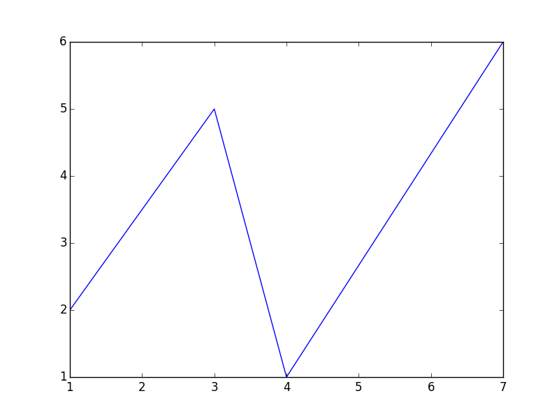

# Write a Brief Descriptive Title Here
# HW7 API Data - MTA API

Authors:  **Ling Lin**, **Xuanyu Lu** and **Qingyang Xiao**

---

**NOTE**:  The *italicized* content below is for your reference only.  Please remove these comments before submitting.

---

## Introduction
*The purpose of this section is to provide some information about the data you're exploring.  For example, you should*
- *Describe the type of data that you're importing.* 
- *Describe the source of the data.  Include URLs.*  
- *Explain how recent is this data?  How often is it updated?*

---

## Sources
*In this section, provide links to your references.  For example:*
- The source code came from [the magic source code farm](http://www.amagicalnonexistentplace.com)
- The code retrieves data from [the organization for hosting cool data](http://www.anothermagicalnonexistentplace.com)

## Sources
*In this section, provide links to our references.

- Reference for API


- References used in Transform API data to Python Dataframe section
1. https://thispointer.com/pandas-convert-dataframe-index-into-column-using-dataframe-reset_index-in-python/
2. https://pandas.pydata.org/pandas-docs/stable/reference/api/pandas.DataFrame.rename.html
3. https://discuss.codecademy.com/t/can-we-add-a-new-column-at-a-specific-position-in-a-pandas-dataframe/355842
4. https://pandas.pydata.org/pandas-docs/stable/reference/api/pandas.Timestamp.html


---

## Explanation of the Code
*In this section you should provide a more detailed explanation of what, exactly, the above code actually does.  Your classmates should be able to read your explanation and understand what is happening in the code.*

The code, `needs_a_good_name.py`, begins by importing necessary Python packages:
```
import matplotlib.pyplot as plt
```

- *NOTE:  If a package does not come pre-installed with Anaconda, you'll need to provide instructions for installing that package here.*

We then import data from [insert name of data source].  We print the data to allow us to verify what we've imported:
```
x = [1, 3, 4, 7]
y = [2, 5, 1, 6]

for i in range(0,len(x)):
	print "x[%d] = %f" % (i, x[i])		
```
- *NOTE 1:  This sample code doesn't actually import anything.  You'll need your code to grab live data from an online source.*  
- *NOTE 2:  You will probably also need to clean/filter/re-structure the raw data.  Be sure to include that step.*

Finally, we visualize the data.  We save our plot as a `.png` image:
```
plt.plot(x, y)
plt.savefig('samplefigure.png')	
plt.show()
```

The output from this code is shown below:



---

## Explanation of the Code (Ling edited, Not done yet)
*In this section of code, we will transform the API data into a python dataframe.*

The API data comes in as a dictionary format.\
Convert API data from dictionary format into a python dataframe and display what does the original dataframe looks like
```
Schedule = pd.DataFrame.from_dict(q_train_stops, orient='index')
Schedule
```

Add the index to be a new column in dataframe
The original index is stop_id, so add stop_id to be a new column of dataframe
```
Schedule1 = Schedule.reset_index()
```

Rename the newly added column as "stop_id"
```
Schedule2 = Schedule1.rename(columns={'index':'stop_id'})
```

Read the last character of stop_id to identify the direction, N represents North, S represents South
```
Direction = []

for i in range(0, len(Schedule)):
    Direction.append(Schedule2.stop_id[i][-1])
        
# Direction
```

Insert the new direction column to a specific postion, e.g. position 1 in this case
Do not run this code the second time without rerun the above codes, 
because it will appear an error if the column is already inserted 
```
Schedule2.insert(1, 'direction', Direction)
```

Extract date information from the Timestamp column, create a new column and insert it to position 2
```
Schedule2.insert(2, 'date', Schedule2[0].dt.date)
```

Replace the original Timestamp columns (Timestamp shows date and time) with time only
```
for j in range(0, len(Schedule2)):                # loop through rows
    for k in range(3, len(Schedule2.iloc[0])):       # loop through columns 
        if pd.notna(Schedule2.iloc[j, k]):              # Checking for missing value
            Schedule2.iloc[j, k] = pd.Timestamp.time(Schedule2.iloc[j, k])
```            
Display what does the new dataframe looks like now
```
Schedule2
```

---

## How to Run the Code
*Provide step-by-step instructions for running the code.  For example, I like to run code from the terminal:*
1. Open a terminal window.

2. Change directories to where `needs_a_good_name.py` is saved.

3. Type the following command:
	```
	python needs_a_good_name.py
	```

- *NOTE: You are welcome to provide instructions using Anaconda or IPython.*

---

## Suggestions
*Finally, you should suggest any additional features that would be useful/interesting.  For example, what else could you do with these data?  How might you want to modify the plot to be more descriptive?  What summary statistics might you want to calculate with these data?*
